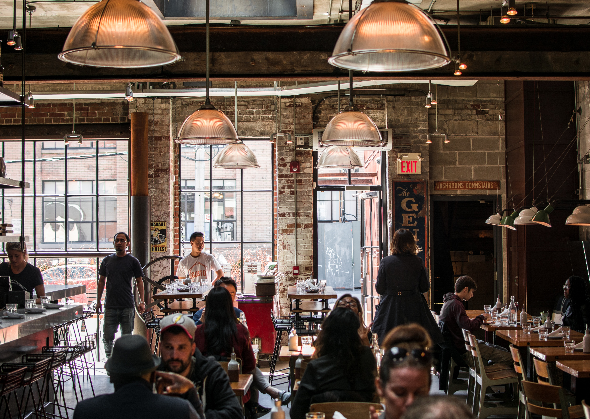

## Witamy w <strong>Mario Italiano</strong>, Twoim ulubionym miejscu na pyszne, autentyczne pizze w sercu Świebodzina.

Nasze pizze są wykonane z najświeższych składników i gotowane do perfekcji w naszym piecu opalanym drewnem. Od klasycznej margherity po kreatywne placki z wierzchu, każdy znajdzie coś dla siebie.

Nasza przytulna, niezobowiązująca atmosfera jest idealna na szybką kolację z przyjaciółmi lub wieczór na randce. Dla Twojej wygody oferujemy również opcję jedzenia na wynos i z dostawą.

Nie możemy się doczekać, aby służyć Ci w Mario Italiano. Do zobaczenia wkrótce!

## O naszej restauracji

 Jak tylko przejdziesz przez drzwi, przywita Cię aromat świeżo upieczonej pizzy i skwierczące dźwięki naszego pieca opalanego drewnem.

Wnętrze naszej pizzerii jest ciepłe i zachęcające, z rustykalnym, autentycznym włoskim klimatem. Odkryte ceglane ściany i drewniane belki nadają przestrzeni przytulną, domową atmosferę, a otwarta kuchnia i część wypoczynkowa pozwalają obserwować naszych wykwalifikowanych pizzaiolos przy pracy.

Do wyboru są tradycyjne drewniane stoły i krzesła, a także pluszowe kabiny, które zapewniają bardziej swobodną i relaksującą atmosferę. Ściany zdobią kolorowe murale i dzieła sztuki, które dodają przestrzeni koloru i charakteru.

W oczekiwaniu na pyszną pizzę, możesz zapoznać się z naszym bogatym menu napojów, 

Mamy nadzieję, że będziesz zadowolony z wizyty w naszej pizzerii. Buon appetito!

## Nasza Historia 

 Mario Italiano została założona latem 1990 roku przez człowieka o imieniu Mario, który niedawno wyemigrował do Polski z Włoch. Giovanni był szefem kuchni we Włoszech przez wiele lat, a swoją miłość i pasję do pizzy przywiózł ze sobą do Polski.

Giovanni zaczął od małego, otwierając małą pizzerię w ruchliwym centrum miasta. Używał tylko najświeższych składników i robił wszystkie pizze ręcznie, korzystając z tradycyjnych włoskich przepisów. Pizzeria szybko zyskał wiernych fanów, a przed długi czas, Mario był w stanie rozwinąć działalność i otworzyć dodatkowe lokalizacje.

Z biegiem lat, Mario Italiano  się ukochaną instytucją w społeczności. Znana jest z pysznej, autentycznej włoskiej pizzy i przyjaznej, gościnnej atmosfery. Pomimo konkurencji ze strony nowszych, modniejszych pizzerii, Papa's Pizza Place przetrwała próbę czasu i pozostaje popularnym wyborem zarówno dla mieszkańców, jak i turystów.

## Nasz zespół 

| Imię  | Rola  | Lata stażu |
|-------|-------|-------------------|
| Mario | Główny kucharz | 5+ lat        |
| Samantha | Kasa, pomocnik w kuchni | 3 lata       |
| Daisy    | Kelnerka                   |    3 lata           |
| Marian         |                     Dostawa       |  5 lat                   |
| Luigi | Ochrona | Rok        |

## Galeria

  
  
  

